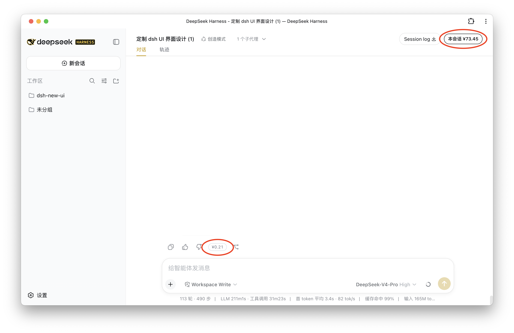
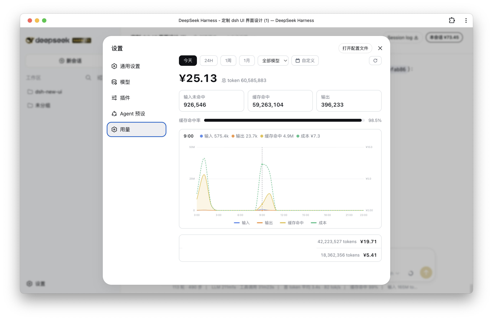

# @frostgao/dsh-usage-cost

DeepSeek 用量 / 成本统计插件（DeepSeek Harness / DSH）· A usage & cost tracker for the DeepSeek Harness.

[English](#english) · [中文](#chinese)

---

## Screenshots · 截图

| 聊天界面 · Chat | 设置「用量」页 · Usage page |
| --- | --- |
|  |  |

---

<a id="english"></a>

## English

A **usage & cost tracker** for the [DeepSeek Harness](https://github.com/deepseek-ai/deepseek-harness). It shows real-time token usage and billed cost directly in the UI, plus a full "Usage" settings page.

### What it does

- **Session cost badge** (top-right header): a live `¥` badge for the current session; clicking it opens Settings and jumps to the Usage page.
- **Per-reply cost chip**: a small `¥` label next to each assistant message.
- **Settings "Usage" page**:
  - Range filter (Today / 24H / 1 week / 1 month) + model dropdown + custom date-time range + refresh.
  - Total cost, total tokens, three buckets (uncached input / cache hit / output), cache-hit-rate progress bar.
  - Hand-written smooth SVG trend chart (input / output / cache hit / cost; dual y-axis; hover crosshair).
  - Per-session list (title + tokens + cost).
- Host-side 3-hour TTL cache with stale-while-revalidate; `refresh: true` forces a synchronous recompute; custom ranges are never cached.

### Install

```bash
npm install @frostgao/dsh-usage-cost
```

Add one row to your DSH profile's patch file (`~/.dsh/profiles/web/cordis.patch.yml`):

```yaml
- insert:
    - id: usage-cost
      name: '@frostgao/dsh-usage-cost'
```

Restart `dsh web`.

### Requirements

- DeepSeek Harness (any recent version).
- The `@deepseek-ai/dsh-client-ui-theme` plugin must be composed (it is, in every shipped profile).

### Pricing (0817)

Unit: **CNY per million tokens**. Peak = Beijing time `09:00–12:00` and `14:00–18:00`; all other times are off-peak (half the peak price).

| Model | Bucket | Off-peak | Peak |
| --- | --- | --- | --- |
| `deepseek-v4-flash` | cache hit | 0.05 | 0.10 |
| | uncached input | 1.50 | 3.00 |
| | output | 4.50 | 9.00 |
| `deepseek-v4-pro` | cache hit | 0.15 | 0.30 |
| | uncached input | 4.50 | 9.00 |
| | output | 13.50 | 27.00 |

`cost = (uncached_input × rate + cache_hit × rate + output × rate) / 1e6`. Unknown models are billed as `deepseek-v4-pro`. Pricing is the **0817** snapshot of the official rate table.

### Theming

Accent colors follow the theme token `--dsw-alias-brand-primary`, so the plugin adapts automatically to the active theme — no configuration needed.

### Caveats

- **"Today"** means the Beijing calendar day (00:00–24:00 Beijing time).
- The Typert artifacts (`lib/typert.host.js`, `lib/typert.remote-client.js`) are committed by hand because the upstream `typertPlugin({ mode: 'package' })` requires a full workspace and cannot run inside a standalone package. If you add/change `@Remote` methods, regenerate these two files to match.
- Pricing is a snapshot of the official table; edit `src/pricing.ts` and rebuild when DeepSeek changes rates.

### Related

- [`@frostgao/dsh-theme-blackgold`](https://github.com/frostgao/dsh-theme-blackgold) — the black-gold theme this plugin pairs with.

### License

MIT — see [LICENSE](./LICENSE).

---

<a id="chinese"></a>

## 中文

一个适用于 [DeepSeek Harness](https://github.com/deepseek-ai/deepseek-harness) 的 **用量 / 成本统计插件**，在界面上实时显示 token 用量与费用，并提供一个完整的「用量」设置页。

### 功能

- **会话成本徽章**（右上角）：实时显示当前会话的 `¥` 金额，点击可打开设置并跳到「用量」页。
- **每条回复成本 chip**：每条助手消息旁的 `¥` 标签。
- **设置「用量」页**：
  - 时段筛选（今天 / 24H / 1周 / 1月）+ 模型下拉 + 自定义时间段（起止时间）+ 刷新。
  - 总成本、总 token、三个分桶（输入未命中 / 缓存命中 / 输出）、缓存命中率进度条。
  - 手写平滑 SVG 趋势图：输入 / 输出 / 缓存命中 / 成本四条线，双 y 轴，悬停查看各时刻数值。
  - 按对话列表（标题 + tokens + 成本）。
- Host 端 3 小时 TTL 缓存 + stale-while-revalidate；`refresh:true` 强制同步，自定义时间段不缓存。

### 安装

```bash
npm install @frostgao/dsh-usage-cost
```

在 DSH profile 的补丁文件（`~/.dsh/profiles/web/cordis.patch.yml`）里加一行：

```yaml
- insert:
    - id: usage-cost
      name: '@frostgao/dsh-usage-cost'
```

重启 `dsh web`。

### 依赖要求

- DeepSeek Harness（任意近期版本）。
- 必须组合 `@deepseek-ai/dsh-client-ui-theme`（每个默认 profile 都已组合）。

### 计费规则（0817）

单位：**人民币 元 / 百万 tokens**。高峰时段 = 北京时间 `09:00–12:00` 与 `14:00–18:00`，其余为空闲（空闲价 = 高峰价一半）。

| 模型 | 桶 | 空闲 | 高峰 |
| --- | --- | --- | --- |
| `deepseek-v4-flash` | 缓存命中 | 0.05 | 0.10 |
| | 输入未命中 | 1.50 | 3.00 |
| | 输出 | 4.50 | 9.00 |
| `deepseek-v4-pro` | 缓存命中 | 0.15 | 0.30 |
| | 输入未命中 | 4.50 | 9.00 |
| | 输出 | 13.50 | 27.00 |

`成本 = (未命中输入 × 单价 + 缓存命中 × 单价 + 输出 × 单价) / 1e6`。未知模型按 `deepseek-v4-pro` 计价。价目表为官方 **0817** 版快照。

### 配色

强调色跟随主题 token `--dsw-alias-brand-primary`，会自动适配当前主题，无需任何配置。

### 注意事项

- **「今天」** 指北京时间自然日（北京时间 00:00–24:00）。
- Typert 产物（`lib/typert.host.js`、`lib/typert.remote-client.js`）为手工维护并随包发布——上游 `typertPlugin({ mode: 'package' })` 依赖完整 workspace，无法在独立包内运行。若增改 `@Remote` 方法，需同步重新生成这两个文件。
- 价目表是当前官方价格快照；DeepSeek 调价时请修改 `src/pricing.ts` 并重新构建。

### 相关项目

- [`@frostgao/dsh-theme-blackgold`](https://github.com/frostgao/dsh-theme-blackgold) —— 与本插件搭配的黑金主题。

### License

MIT — 见 [LICENSE](./LICENSE)。
